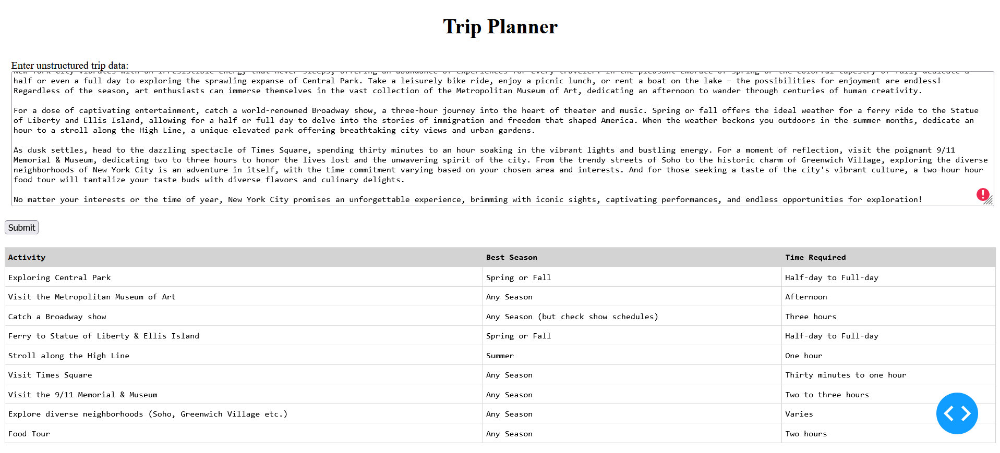

# Trip Planner API with Google AI Studio Integration

This project is a Dash-based web application that processes unstructured data and converts it into structured, tabular data using Google AI Studio's Generative Language API.

## Features
- Leverages the Google AI Python SDK to interact with the Generative Language API.
- Processes unstructured data into a structured format (tabular columns).
- Secure environment setup using `.env` for sensitive API keys.
- Containerized deployment using Docker.

# Which is Bigger?

## Overview

The **"Which is Bigger?"** project is a Python-based web application powered by **Dash** and the **Gemini Generative AI** model. This app compares two numbers and determines which one is larger using advanced AI capabilities. The project is containerized with Docker for easy deployment and scalability.

---

## Features

- Simple and intuitive user interface built with **Dash**.
- Uses **Google Gemini Generative AI** to make comparisons.
- Securely manages sensitive API keys using environment variables.
- Fully containerized with Docker for seamless deployment.

---

## Project Structure

```
project/
├── app.py             # Main application entry point
├── ai.py              # API module interacting with Google AI Studio
├── requirements.txt   # Python dependencies
├── Dockerfile         # Docker configuration
├── .dockerignore      # Docker ignore file
├── .env               # Environment variables (API key)
└── README.md          # Project documentation
```


---

## Prerequisites

- Python 3.9 or higher
- Docker (if running in a container)
- An active **Gemini API key**

---

## Installation

### Local Setup

1. Clone the repository:
   ```bash
   git clone https://github.com/your-repo/tour-planner.git
   cd tour-planner
   ```
2. Create a virtual environment:
   ```bash
   python -m venv venv
   source venv/bin/activate  # On Windows: venv\Scripts\activate
   ```
3. Install dependencies:
   ```bash
   pip install -r requirements.txt
   ```
4. Set the environment variable for the API key:
   - On Linux/macOS:
     ```bash
     export GEMINI_API_KEY="your_api_key_here"
     ```
   - On Windows:
     ```powershell
     set GEMINI_API_KEY="your_api_key_here"
     ```
5. Run the app:
   ```bash
   python app.py
   ```
6. Open your browser and navigate to:
   ```
   http://localhost:8050
   ```

---

### Docker Setup

1. Build the Docker image:
   ```bash
   docker build -t tour-planner .
   ```
2. Run the Docker container:
   - With environment variable:
     ```bash
     docker run -d -p 8050:8050 -e GEMINI_API_KEY="your_api_key_here" tour-planner
     ```
   - With `.env` file:
     ```bash
     docker run -d -p 8050:8050 --env-file .env tour-planner
     ```
3. Open your browser and navigate to:
   ```
   http://localhost:8050
   ```

## Environment Variables

The app requires the following environment variable:

- `GEMINI_API_KEY`: Your Gemini API key. This is mandatory and must not be hardcoded.

For local development, create a `.env` file in the project root:

```
GEMINI_API_KEY=your_api_key_here
```
### Screenshot



---

